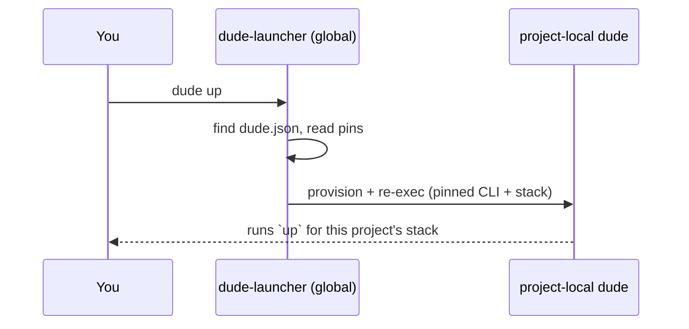

# How it works

Five ideas explain almost everything about `dude`: the **launcher**, the
**pinned toolchain**, the split between the **CLI runtime** and **stack
plugins**, **template overlays**, and **release channels**.

---

## The launcher and the pinned toolchain

You install exactly one thing globally: `@cubocicloide/dude-launcher`. It is a
thin shim with no project logic of its own.

When you type `dude <command>` anywhere, the launcher:

1. Walks up from the current directory to find the nearest `dude.json`.
2. Reads the CLI and stack versions pinned there.
3. Provisions that toolchain if it isn't installed yet.
4. Re-execs the project-local `dude` with your command.

The consequence: **every project runs its own pinned versions**. Project A can
sit on an old CLI while project B rides the latest — no version switching, no
global upgrades that break yesterday's repo.

Both pins live in two places, kept in lockstep:

- **`package.json`** — the CLI and stack as `devDependencies`, so `pnpm install`
  provisions a reproducible toolchain from the lockfile.
- **`dude.json`** — mirrors the pins (`stack`, `stackVersion`, `dudeVersion`)
  for provenance, and records the answers you gave at `dude init`.

Move the pins with [`dude upgrade`](commands.md#dude-upgrade); it edits both
files together. Run `pnpm install` afterwards.

---

## CLI runtime vs. stack plugins

`dude` is deliberately split in two:

- The **CLI runtime** (`@cubocicloide/dude`) is stack-agnostic. It owns the
  commands that make sense for *any* project — `init`, `upgrade`, `version`,
  `info`, `help` — plus the command dispatcher, the config/registry loader,
  the template engine, and the lint engine.
- A **stack plugin** (e.g. `@cubocicloide/stack-react-fastapi`) teaches the CLI
  about one kind of application. It ships the templates to scaffold it, the lint
  rules that enforce its conventions, and the stack-specific commands (`up`,
  `lint`, `test`, `db`, `iac`, …).

Because stacks are just packages, adding a new one — or extending an existing
project — never requires forking the CLI.

---

## Command resolution

`dude <command>` resolves with a fixed precedence: **project-custom → stack →
core**.

| Source         | Where it lives                       | Example                       |
| -------------- | ------------------------------------ | ----------------------------- |
| Project-custom | `.dude/commands/<name>.ts`           | a repo's bespoke `seed` task  |
| Stack          | the active stack plugin              | `up`, `lint`, `test`, `iac`   |
| Core           | the CLI runtime                      | `init`, `upgrade`, `info`     |

A project can add commands (and lint rules) without touching the stack, and a
stack command can override a core one of the same name. `dude help` always
prints the merged, resolved catalog for the project you're standing in.

---

## Template overlays

A stack scaffolds projects from **overlays** — layered sets of files applied in
order, with later layers winning on conflict. A `base` overlay is always
applied; optional overlays switch on based on your init answers (a database
overlay when you choose Postgres, an IaC overlay when you enable cloud
deployment, and so on).

Files ending in `.hbs` are processed with Handlebars — the stack fills in your
project name and feature flags — and plain files are copied verbatim. The result
is a project tailored to exactly the options you picked, with no dead
scaffolding to delete.

---

## Release channels

Every publishable package moves through two channels, implemented as npm
dist-tags on GitHub Packages:

| Channel       | dist-tag | Who gets it                                                         |
| ------------- | -------- | ------------------------------------------------------------------- |
| **Candidate** | `next`   | Opt-in: `dude init --next`, `dude upgrade --next`                   |
| **Stable**    | `latest` | Everyone by default (`dude init`, `dude upgrade`)                   |

Every publish lands on `next` first. Promotion to `latest` is explicit and
per-package, so stable users are never surprised by an unproven release. A
brand-new stack has no `latest` tag until its first promotion — until then,
scaffold it with `--next`.

!!! info "For maintainers"
    The publish and promotion workflow lives in the repository's
    `CONTRIBUTING.md`.
