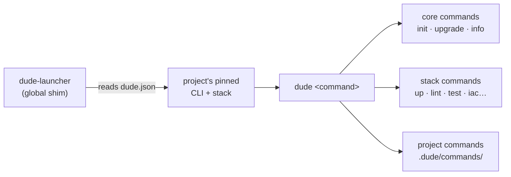

# dude

**dude** is Cubocicloide's project scaffolding & code-quality CLI. One command
turns a blank directory into a running, production-shaped project — frontend,
backend, database, background jobs, tests, security scanning, docs, and cloud
infrastructure — all wired together and following the same conventions across
every team.

```bash
dude init my-app        # scaffold
cd my-app && pnpm install
dude up                 # everything running in Docker
```

---

## Why dude

Starting a new service usually means copying last quarter's repo, deleting what
you don't need, and hoping you didn't miss a config. Six months later every
project drifts into its own shape and onboarding a teammate takes a week.

`dude` replaces that with **stacks** — opinionated, versioned blueprints for a
whole application. A stack knows how to scaffold the project, how to lint it for
convention violations, how to run it locally, and how to ship it to the cloud.
You pick a stack; `dude` does the rest.

- **Consistent** — every project of a given stack looks the same. Lint rules
  enforce the conventions, so drift is caught in CI, not code review.
- **Reproducible** — the CLI and the stack are pinned per project (in
  `dude.json` and the lockfile). Two people, two machines, same toolchain — no
  "works on my machine".
- **Batteries included** — Docker Compose for local dev, a typed API client,
  database migrations, background workers, e2e tests, security scanners, a docs
  site, and optional cloud IaC all ship in the box.
- **Extensible** — stacks are plugins. Projects can add their own commands and
  lint rules without forking anything.

---

## The mental model



You install **one** thing globally — the launcher. Inside any project it finds
that project's pinned versions and runs them, so different projects can use
different `dude` versions with no switching. See
[How it works](concepts.md) for the full picture.

---

## Where to go next

- **[Getting started](getting-started.md)** — install the launcher, authenticate
  the registry, scaffold your first project.
- **[How it works](concepts.md)** — the launcher, pinned toolchains, stack
  plugins, template overlays, and release channels.
- **[Stacks](stacks/index.md)** — the catalog of available stacks, a comparison
  matrix, and what each one scaffolds.
- **[Command reference](commands.md)** — the core CLI commands. Stack-specific
  commands are documented inside each generated project (`dude docs`).
- **[Troubleshooting](troubleshooting.md)** — common issues and how to file a
  good bug report.
