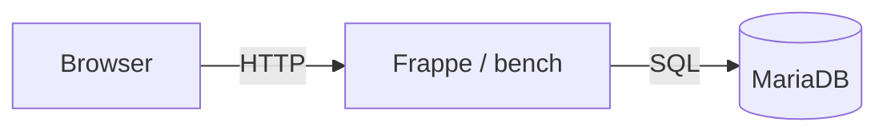
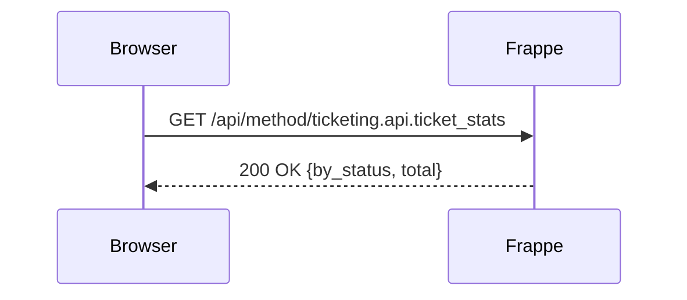

# Writing docs

This project uses [MkDocs Material](https://squidfunk.github.io/mkdocs-material/)
for documentation. Pages are Markdown files stored under `docs/docs/`.

---

## Getting started

Start the live-reload server:

```bash
dude docs
```

Open [http://localhost:8001](http://localhost:8001), then edit any `.md` file —
the browser refreshes automatically.

---

## Adding a page

1. Create a new `.md` file under `docs/docs/` (e.g. `docs/docs/runbook.md`).
2. Add it to the `nav` section in `docs/mkdocs.yml`:

```yaml
nav:
  - Home: index.md
  - Frappe core concepts: frappe.md
  - Extending the app: extending.md
  - Working with dude: dude.md
  - Runbook: runbook.md   # ← new entry
```

That is all — MkDocs will include it in the sidebar automatically.

---

## Markdown syntax

### Formatting

- **Bold**: `**text**`
- _Italic_: `_text_`
- `Code`: `` `text` ``
- ==Highlight==: `==text==`
- ^^Underline^^: `^^text^^`
- ~~Strikethrough~~: `~~text~~`

---

### Admonitions

Use admonitions to call out important information:

```markdown
!!! note "Title"
    Body text here.

!!! tip "Tip"
    A helpful hint.

!!! warning "Warning"
    Something to be careful about.

!!! danger "Danger"
    A critical warning.
```

Renders as:

!!! note "Note"
    Use notes for supplementary information that is useful but not critical.

!!! tip "Tip"
    Use tips for best practices and shortcuts.

!!! warning "Warning"
    Use warnings for things that can cause unexpected behaviour.

!!! danger "Danger"
    Use for actions that can cause data loss or security issues.

Collapsible variant (closed by default):

```markdown
??? info "Click to expand"
    Hidden until clicked.
```

Collapsible, open by default:

```markdown
???+ info "Expanded by default"
    Visible, but collapsible.
```

---

### Code blocks

Fenced code block with syntax highlighting:

````markdown
```python linenums="1"
def greet(name: str) -> str:
    return f"Hello, {name}!"
```
````

Renders as:

```python linenums="1"
def greet(name: str) -> str:
    return f"Hello, {name}!"
```

With line highlighting:

````markdown
```python hl_lines="2 3"
def example():
    x = 1      # highlighted
    y = 2      # highlighted
    return x + y
```
````

---

### Diagrams (Mermaid)

MkDocs Material renders [Mermaid](https://mermaid.js.org/) diagrams natively:

````markdown

````

Renders as:


Sequence diagram:



---

### Tables

```markdown
| Column A | Column B | Column C |
|----------|----------|----------|
| Value 1  | Value 2  | Value 3  |
| Value 4  | Value 5  | Value 6  |
```

| Column A | Column B | Column C |
|----------|----------|----------|
| Value 1  | Value 2  | Value 3  |
| Value 4  | Value 5  | Value 6  |

---

### Task lists

```markdown
- [x] Completed task
- [ ] Pending task
- [ ] Another pending task
```

Renders as:

- [x] Completed task
- [ ] Pending task
- [ ] Another pending task

---

### Tabs

```markdown
=== "Python"
    ```python
    print("Hello, world!")
    ```

=== "TypeScript"
    ```typescript
    console.log("Hello, world!")
    ```
```

=== "Python"
    ```python
    print("Hello, world!")
    ```

=== "TypeScript"
    ```typescript
    console.log("Hello, world!")
    ```

---

## File structure

```
docs/
├── mkdocs.yml        # MkDocs configuration
└── docs/             # Source pages (edit these)
    ├── index.md      # Home page
    ├── frappe.md     # Frappe core concepts (guided tour)
    ├── extending.md  # Cookbook: add a DocType, task, workflow…
    ├── dude.md       # CLI reference
    ├── api.md        # Auto-generated command reference
    └── mkdocs.md     # This page
```

Add new `.md` files here and register them in `mkdocs.yml`.
